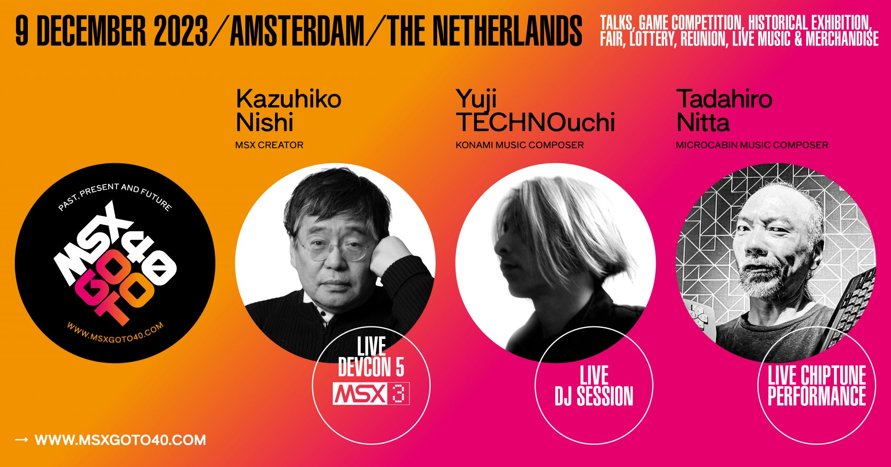

# Assignment 2

"Playful Musical Experience" 

For this assignment you will be exploring musical play and experimentation, by creating virtual musical instruments using Godot and performing in a band with instruments you make.

Form a team of up to 4 people:

- Do research! Explore trad sessions, drum and bass, psytrance music, sequencers, drum machines, theramins, DAW's
- Create virtual musical instruments using Godot. You can use the sounds you record from real instruments or, your voice or the world around you. Your instrument can be a simple soundboard or a full sequencer. The more complex and fully featured, the better mark you will achieve. You can add sequencing, audio effects, looping, experimental input system using voice or a real instrument or MIDI controller, game controller, camera, input device. 
- Each team member will make a separate instrument, or element of an instrument they can play in a a live performance at the conclusion of the project.
- You can design your instrument and UI and functionality on paper and I will teach you what you need to know about music and Godot to bring the instrument to life
- The project should be made in Godot and must be managed in a git repository. It can be 2D, 3D or VR. Each person on the team must write code and make commits. 

## Rubric

| Category | Weighting | 1 | 2.1 | 2.2 | Pass | Fail |
|----------|-----------|--------|----|----|----|----|
| Complexity | 25% | Use of complex algorithms. For loops and arrays. Use of advanced systems in Godot. A lot of new nodes created. Complex UI interaction such as drag and drop, timers, UI controls. UI created procedurally. Lots of variety in the sounds created. Use of controllers or external input. The instrument is "programmable". Sound is generated procedurally. Excellent visual feedback | Simple UI based on clicking buttons to make sounds. Use of loops and at least one array. Use of timers. UI is generated in editor.  No external input. Good variety of sounds. Based on a real instrument | A basic soundboard with buttions to make sounds | Forked the repo, made some commits, not much working, but it makes a sound | Failed to fork the repo, no commits made |
| Aesthetic | 25% | Novel user interface for creating live sound. Complex button and knob arrangement. High quality of visual design. Original, high quality assets produced. Original high quality recorded audio. Visually coherent and easy to use. Great variety of musical expressiveness. Sounds are interesting and coherent. Crazy and beautiful and lots of novelty | Straightforward, intuitive interface with a reasonable amount of control of a good range of sound. Ability to perform live with a good degree of expression. Some simple assets created. | Basic interface with one screen. Some assets made and some acquired from online sources. Not too much variety in the expressiveness of the instrument | Simple or unintuitive user interface. User interface made from premade assets. Sound are premade or made using simple tools | Basic user interface that makes sound, without any expressiveness or novelty or much fun. | Project doesnt make any sound
| Performance | 25% | Team performs an original piece of experimental music for a duration of 5 minutes on their instruments. Each team member presses buttons on the thing they have made and contributes sound to the performance. Live instruments incorporated. Visuals incorporated (music be made and controlled in Godot). Team synchronises their performance. Special costumes made. Use of facepaint. Drag. An interpretive dance performance | Team performs and original piece of experimental music for a duration of 3 minutes on their instruments. No live instruments, costumes or special dances | Team performs a 1 minute piece of music. No coordination, but everybody plays together | No performance, just a demo where the team shows their instruments | No performance and no demo |
| Teamwork & Documentation | 25% | Large number of individual commits. Each team member makes equal commits. High quality video and detailed documentation, with all sections completed. Team met and collaborated regularly and showed progress each week. Commits evenly spaced throughout the project | Smaller number of commits over a shorter period of time, but a good bit of work evident in the latter weeks of the project. Video and documentation completed to high standard | All done in week or two before the delivery date. Lots of commits in last two weeks. Documentation incomplete or video incomplete. | All done in the final week. Incomplete documentation or video. Few commits | No use of git. project doesnt work |

# Assignment 1

Form a team of max 5 people and develop a piece of generative art using Processing & Python inspired by the any of the following ideas:

- YM2413 Sound Chip
- The Number 52: "I love the number 52. I had an intern when I worked at MicroCabin. He always did an impression of his uncle who ran lotteries. He always called the number 52; that's why I came to like it. Patrol cars driving around the city often have a  number. I fantasized about such cars; about a car with the number 52, which was the fastest of all cars
- Wave Injection: "The title of "Wave Injection" that I am presenting this time was born from my desire to continue to be a "Wave" (sound and wave) emitting device. Everyone! Enjoy forever! Create forever!"
- MSXGOTO40
- The Story of DANI. The AI Chatbot from 1987 that arrives in 2023. See http://bryanduggan.org

The piece can last up to 1 minute. You can use any combination of: 

- HSB Colour space, procedurally generating colours
- Laying elements with alpha
- Drawing using line, circle, ellipse etc
- 3D Shapes
- 8 Bit style graphics
- Movement
- Spinning logos
- Making classes for visual elements

A selection of the projects will be displayed during Nito San's music performance on the msx MSX at MSXGOTO40, Amsterdam on Dec 9, 2023. In order to be eligible you must complete your project by 1 December 2023. This assignment is worth 25% of your overall grade.

You can work on the project during lab time on Mondays and expected to do work outside of class. Make a github repository for your project, so you can collaborate. Each team member should make commits on the repository as evidence of work. 

## Grading:

You will be graded based on the following criteria:

- Creativity, originality and novelty in the visual elements and overall visual design: 35%
- Technical proficiency in using Processing & Python 35%
- Collaboration and teamwork in dividing tasks and managing the project using Github: 15%
- Quality and professionalism of the final program and video presentation: 15%

Check out [playlists of previous assignments](https://www.youtube.com/@skooter500/playlists) for inspiration.

## Rubric

| Grade | Description |
| ------|-------------|
| First | Looks beautiful, colours work really well together. All the visual elements combine well. Close adherence to the theme and excellent use of storytelling, progression in the project. Deep knowledge of source material evident. Visually complex with many interacting elements. Technically complex with use of classes, vectors and transforms. Great teamwork. All team members making documented commits. Lots of self directed learning. Great documentation and video demo. All team members making commits on the repo. Great teamwork evident |
| 2.1 | The assignment is fairly complex with some elements interacting in a straight-forward way such as colours changing or shapes changing size. There is a some movement. You have added a few features that you have had to learn some programming stuff for. You made or programmed all the art assets but maybe got some stuff online too. Your colours are good but could use some improvement to make them more beautiful. You have used classes, but maybe not inheritance & polymorphism. Good documentation and all team members making commented commits |
| 2.2 | The assignment isn't complex and is mostly based on modifying the examples we developed in the class. Your documentation is minimal and little evidence of good project management. Development on the project was rushed and you left everything until the week before the submission deadline. There are are incomplete features or things you planned to get working and couldn't. No youtube video or minimal documentation. |
| Pass | Something very basic that is just a small modification of the code we developed in the class. Missing documentation. Completed in the days before the submission deadline and minimal or missing documentation. |
| Fail | Project won't compile or major issues. |

# Grading
- Lab Test 1 25%
- Lab Test 2 25%
- Assignment 1 25%
- Assignment 2 25%